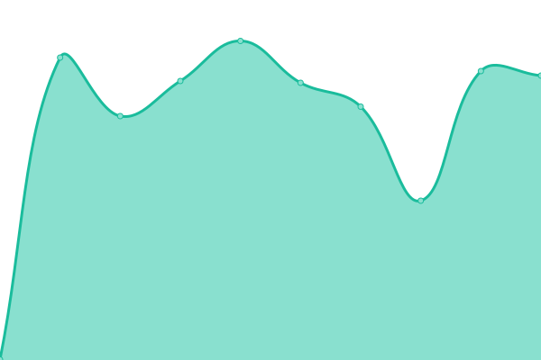

# [📈 Live Status](https://status.kerberos.io): <!--live status--> **🟧 Partial outage**

This repository contains the open-source uptime monitor and status page for [Kerberos.io](https://kerberos.io), powered by [Upptime](https://github.com/upptime/upptime).

<!--start: status pages-->
<!-- This summary is generated by Upptime (https://github.com/upptime/upptime) -->
<!-- Do not edit this manually, your changes will be overwritten -->
<!-- prettier-ignore -->
| URL | Status | History | Response Time | Uptime |
| --- | ------ | ------- | ------------- | ------ |
|  [Public site](https://kerberos.io) | 🟥 Down | [public-site.yml](https://github.com/kerberos-io/upptime/commits/HEAD/history/public-site.yml) | 

 1688ms
     
 | 

<a href="https://status.kerberos.io/history/public-site">51.87%</a>
    

|  [Documentation](https://doc.kerberos.io) | 🟥 Down | [documentation.yml](https://github.com/kerberos-io/upptime/commits/HEAD/history/documentation.yml) | 

 1249ms
     
 | 

<a href="https://status.kerberos.io/history/documentation">51.90%</a>
    

|  [Agent Demo](https://demo.kerberos.io) | 🟥 Down | [agent-demo.yml](https://github.com/kerberos-io/upptime/commits/HEAD/history/agent-demo.yml) | 

 487ms
     
 | 

<a href="https://status.kerberos.io/history/agent-demo">51.93%</a>
    

|  [Hub](https://app.kerberos.io) | 🟩 Up | [hub.yml](https://github.com/kerberos-io/upptime/commits/HEAD/history/hub.yml) | 

 502ms
     
 | 

<a href="https://status.kerberos.io/history/hub">99.84%</a>
    

<!--end: status pages-->

[**Visit our status website →**](https://status.kerberos.io)

## 📄 License

- Powered by: [Upptime](https://github.com/upptime/upptime)
- Code: [MIT](./LICENSE) © [Kerberos.io](https://kerberos.io)
- Data in the `./history` directory: [Open Database License](https://opendatacommons.org/licenses/odbl/1-0/)
